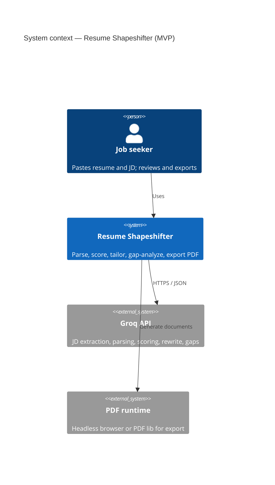
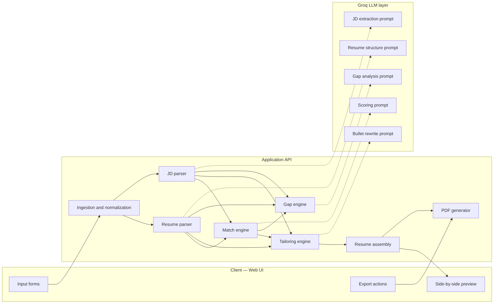
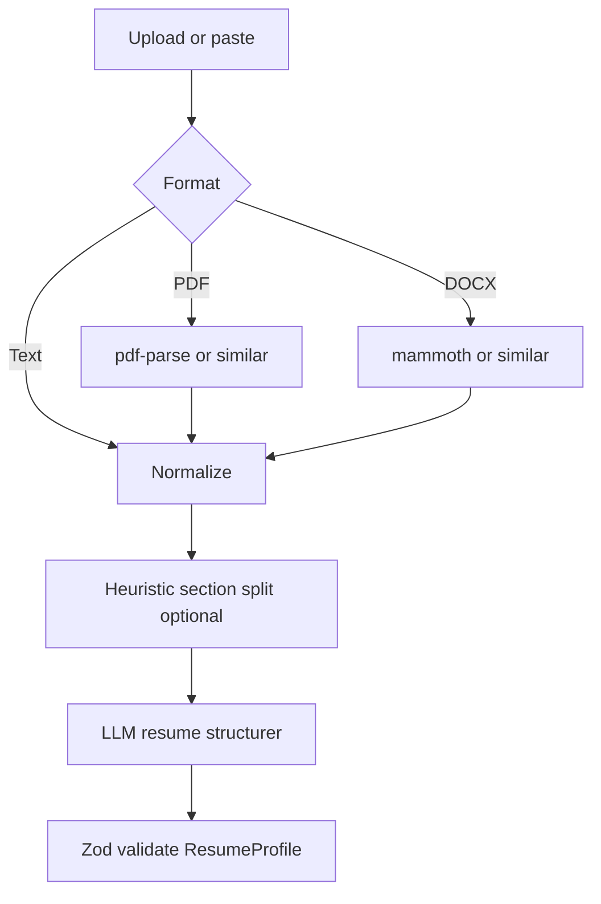
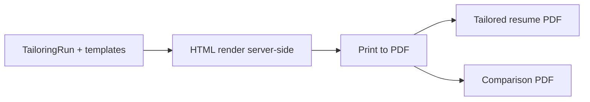

# Resume Shapeshifter — System Architecture

This document describes the target system architecture for **Resume Shapeshifter**, a JD-to-resume tailoring engine. It is derived from the product specification in `context.md` and is intended to guide implementation whether the codebase is greenfield or evolving.

---

## 1. Architecture Goals

| Goal                           | Implication                                                                                            |
| ------------------------------ | ------------------------------------------------------------------------------------------------------ |
| **Truthfulness first**         | Parsing and LLM steps must preserve provenance; rewrites carry confidence, risk flags, and evidence.   |
| **Explainability**             | Match scores, gaps, and bullet changes must be inspectable, not opaque numbers.                        |
| **Vertical slice**             | Prefer one end-to-end path (paste → analyze → tailor → preview → PDF) over scattered partial features. |
| **Structured interchange**     | Resume, JD, scores, tailoring output, and gaps should use validated JSON schemas between stages.       |
| **Portfolio-quality artifact** | Side-by-side PDF is a first-class deliverable, not an afterthought.                                    |

### Non-Goals (MVP)

- Automated job applications, large-scale job-board scraping, guaranteed ATS outcomes, or fabrication of history. See `context.md` §6.

---

## 2. System Context

**Actors:** Job seeker (primary); optional future roles (coach, org admin).

**External systems:** **Groq** (LLM inference, structured JSON where the chosen model supports it), optional object storage for uploads, PDF/runtime for print-quality export.



---

## 3. High-Level Logical Architecture

The product is a **pipeline of deterministic stages** separated by **validated data contracts**. LLM calls are isolated behind small services with fixed JSON outputs.



**Recommended physical mapping (from product doc):**

- **Monolith-friendly MVP:** Next.js (React + API routes) hosting UI and orchestration; LLM and PDF invoked from server only (keys never exposed to browser).
- **Alternative:** Next.js UI + **Python FastAPI** worker for heavy parsing/PDF if team preference or library ecosystem favors Python.

---

## 4. Component Responsibilities

### 4.1 Frontend (Web)

**Stack (recommended):** Next.js, React, TypeScript, Tailwind CSS, Shadcn UI.

| Screen / area     | Responsibility                                                                                        |
| ----------------- | ----------------------------------------------------------------------------------------------------- |
| Landing           | Product explanation, trust framing (truthfulness, user review).                                       |
| Resume / JD input | Paste text; optional file upload (PDF/DOCX) with client-side size/type checks.                        |
| Analysis          | JD summary, extracted requirements, **original** match score, initial gaps.                           |
| Tailoring review  | Side-by-side original vs tailored sections; per-bullet metadata (reason, keywords, confidence, risk). |
| Export            | Download tailored resume PDF and **comparison PDF**; optional future Markdown/DOCX.                   |

**Principles:** Presentation components stay thin; call server actions or REST/JSON endpoints; all Zod-validated responses typed on the client.

### 4.2 Ingestion and Normalization

- Accept **plain text**, **PDF**, and **DOCX** for resumes (MVP); JD as **pasted text** (URL scraping later).
- Normalize encoding, strip obvious noise, and retain **raw source** (or hash) for audit and re-runs.
- Route binary uploads through **virus/size limits** and parse on server.

### 4.3 Resume Parser

**Input:** Raw resume text or extracted text from files.  
**Output:** Structured `ResumeProfile` JSON (see §6.1).

- Rule-based or template heuristics may preprocess; LLM **cleanup / structuring** prompt fills gaps for messy PDFs.
- Preserve section semantics: contact, summary, skills, experience (with bullets), projects, education, certifications.

### 4.4 JD Parser

**Input:** Job description text.  
**Output:** Structured `JobDescriptionProfile` JSON (see §6.2).

- Extract title, company, required vs preferred skills, tools, responsibilities, qualifications, seniority, domain keywords.

### 4.5 Match Engine

**Input:** `ResumeProfile`, `JobDescriptionProfile`.  
**Output:** `MatchScore` (see §6.3).

- Sub-scores (skills, responsibilities, keywords, seniority) roll up to an **overall 0–100** score with a **short natural-language explanation**.
- Surface **critical missing requirements** that drive score penalties.

**Runs twice in the product narrative:** once on the **original** structured resume, once on the **tailored** assembly (or on merged “current draft”) so the UI can show before/after.

### 4.6 Tailoring Engine

**Input:** `ResumeProfile`, `JobDescriptionProfile`, optional prior `MatchScore` / gap hints.  
**Output:** `TailoredResume` (see §6.4).

- Rewrites bullets (primary); may adjust summary, skills ordering, project emphasis per product rules.
- Every rewritten bullet includes: original, tailored, change reason, JD keywords addressed, confidence, risk flag when overstating is possible.

### 4.7 Gap Engine

**Input:** `ResumeProfile` (or tailored), `JobDescriptionProfile`, optional match output.  
**Output:** `GapAnalysis` (see §6.5).

- Classifies gaps (missing skills, weak coverage, tools, domain, seniority, “do not invent”).
- Each gap: name, importance, JD evidence, resume evidence, suggested action, `canSafelyAdd` boolean.

### 4.8 Resume Assembly

- Merges **structured original** with **tailoring deltas** into a single canonical object for rendering and PDF.
- Single place to enforce “no fabricated employers/degrees/metrics” by validating against original fields.

### 4.9 PDF Generator

**Artifacts:**

1. **Tailored resume PDF** — clean, single-column, ATS-friendly layout for MVP.
2. **Side-by-side comparison PDF** — proof document: original vs tailored, highlighted changes, scores before/after, JD summary, gap summary, **disclaimer**.

**Implementation options:** Playwright/Puppeteer print-to-PDF from HTML templates, `@react-pdf/renderer`, or server-side LaTeX (higher cost). MVP favors **HTML → PDF** for speed of iteration.

---

## 5. Data Contracts (Canonical Schemas)

All major payloads should be defined as **TypeScript types** and **Zod schemas** (single source of truth). Names below align with `context.md` §9 and §18.

### 5.1 `ResumeProfile` (parsed resume)

Logical shape:

- `contact`: object (free-form keys acceptable in MVP).
- `summary`: string.
- `skills`: string array.
- `experience`: array of `{ company, title, startDate, endDate, bullets[] }`.
- `projects`, `education`, `certifications`: arrays (structure can extend as needed).

### 5.2 `JobDescriptionProfile` (parsed JD)

- `jobTitle`, `company`, `requiredSkills`, `preferredSkills`, `responsibilities`, `qualifications`, `tools`, `keywords`, `seniorityLevel`, `domainSignals`.

### 5.3 `MatchScore`

- `overallScore`, `skillCoverageScore`, `responsibilityAlignmentScore`, `keywordScore`, `seniorityScore`, `criticalMissingRequirements`, `explanation`.

### 5.4 `TailoredResume`

- `tailoredSummary`, `tailoredSkills`, `tailoredExperience[]` with per-bullet metadata: `original`, `tailored`, `changeReason`, `keywordsAddressed`, `confidence`, `riskFlag`.

### 5.5 `GapAnalysis`

- `gaps[]`: `name`, `importance`, `jdEvidence`, `resumeEvidence`, `suggestedAction`, `canSafelyAdd`.

### 5.6 `TailoringRun` (session / persistence)

Recommended envelope for storage and APIs:

- Identifiers: `id`, `createdAt`, optional `userId`.
- Inputs: resume source refs, raw JD text hash.
- Snapshots: `resumeProfile`, `jobDescriptionProfile`.
- Outputs: `matchOriginal`, `matchTailored`, `tailoredResume`, `gapAnalysis`.
- Status: `draft | ready_for_export | exported`.
- Optional: user overrides / accepted bullets for future versioning.

---

## 6. LLM Layer Design

**Provider (project standard):** [Groq](https://console.groq.com/). All inference runs **on the server** using a **Groq API key** (for example `GROQ_API_KEY` in environment variables). Typical integration uses Groq’s **OpenAI-compatible** HTTP API (`https://api.groq.com/openai/v1`) so the same request patterns (chat completions, optional JSON mode) work with a small client configuration change; the key must never be bundled into client-side JavaScript.

### 6.1 Prompt Modules

One file per concern (example layout from `context.md`):

```text
/prompts/jd-extraction.ts
/prompts/resume-parser.ts
/prompts/match-scoring.ts
/prompts/bullet-rewriter.ts
/prompts/gap-analysis.ts
```

Optional: `prompts/final-assembly.ts` if assembly benefits from a dedicated consolidation pass.

### 6.2 Model and Output Discipline

- Prefer **JSON mode / structured output** when the selected **Groq** model supports it; otherwise enforce JSON via system instructions plus Zod validation and retries (same discipline as for any provider).
- Each prompt returns **strict JSON** matching Zod schemas; on failure, **bounded retries** with repair instructions or a fallback “partial result + error” response to the UI.
- **Temperature** low for extraction and scoring; slightly higher only if bullet variety is too stale (tune in evaluation).

### 6.3 Global Prompt Rules (Truthfulness)

Instructions must enforce (see `context.md` §7.7, §11):

- No invented employers, degrees, certifications, metrics, or tools not evidenced in the resume (unless expressed as a **gap suggestion**).
- Uncertain items marked for **user confirmation**.
- Resume-appropriate bullet length; avoid keyword stuffing; preserve career level.

---

## 7. API Surface (Conceptual)

REST or RPC-style routes under `/api` (Next.js) or FastAPI prefix `/v1`:

| Operation          | Description                                                                                                                 |
| ------------------ | --------------------------------------------------------------------------------------------------------------------------- |
| `POST /analyze`    | Body: resume input + JD text → parsed profiles + original match + initial gaps (may be split into parallel internal calls). |
| `POST /tailor`     | Body: run id or profiles → tailored resume + tailored match + gap refresh.                                                  |
| `POST /export/pdf` | Body: run id + export kind (`tailored` \| `comparison`) → PDF stream or signed URL.                                         |

**Idempotency:** Use client-generated `Idempotency-Key` for export and expensive tailor steps.

**Authentication (post-MVP):** Bearer/session; MVP may be anonymous with server-side session storage.

---

## 8. Document Parsing Pipeline



**Known limitations:** Multi-column PDFs and odd layouts may mis-order text; architecture should allow **manual edit** of parsed text in UI before LLM structuring (Phase 4 polish).

---

## 9. PDF Pipeline



**Comparison PDF content (required):** Header (title, company), original vs tailored scores, JD requirements summary, two columns (original / tailored bullets), visual emphasis on changed bullets, gap analysis, disclaimer.

---

## 10. Data Storage

**MVP:** Session or local server storage (encrypted cookie + server cache, or SQLite file) is acceptable per product guidance.

**Optional persistence entities** (relational or document):

- `User`, `Resume`, `JobDescription`, `TailoringRun`, `MatchScore`, `GapAnalysis`, `ExportedDocument` (metadata + storage key).

**Files:** Store uploads in blob storage or local `uploads/` with short TTL in MVP; never commit secrets or PII to git.

---

## 11. Cross-Cutting Concerns

### 11.1 Security and Privacy

- **Groq API key** (and any PDF-related secrets) only on the **server**; never expose to the browser.
- PII (resume content) encrypted at rest if persisted; minimal retention policy.
- Rate limiting per IP / session on analyze and tailor endpoints.

### 11.2 Validation and Guardrails

- Zod validation at every boundary (LLM output, client display).
- Post-LLM **consistency checks:** tailored bullet must map to an existing experience entry; skills added must appear in “suggested” path if not in original.

### 11.3 Observability

- Structured logs: `tailoringRunId`, stage, latency, token usage (if available), success/fail.
- No raw resume text in logs in production unless explicitly opted in for support.

### 11.4 Configuration

- Environment-based: **`GROQ_API_KEY`**, **`GROQ_MODEL`** (Groq model id), max tokens, feature flags (URL JD import, DOCX upload).

---

## 12. Suggested Repository Layout

Aligned with `context.md` §18:

```text
/app or /src/app          # Routes, server actions
/components               # ResumeInput, JDInput, ScoreCard, GapAnalysis, SideBySideDiff, PDFExportButton
/lib
  schemas.ts              # Zod + inferred types
  prompts.ts              # Re-exports or wiring
  scoring.ts              # Deterministic helpers if any
  pdf.ts                  # PDF generation helpers
/prompts                  # Individual prompt builders
```

Add `/tests` for contract tests on schemas and golden JSON fixtures when implementation begins.

---

## 13. Phased Delivery vs Architecture

| Phase (from `context.md` §15) | Architectural focus                                                  |
| ----------------------------- | -------------------------------------------------------------------- |
| Phase 1: Static prototype     | UI + mock JSON; fake match/tailor/gap payloads through same schemas. |
| Phase 2: LLM integration      | Prompt modules, validation, error handling, run envelope.            |
| Phase 3: PDF export           | HTML templates, headless PDF, asset pipeline.                        |
| Phase 4: Validation           | Stronger Zod, unsupported-claim checks, user confirmation flags.     |
| Phase 5: Polish               | UX, samples, loading/error states, performance.                      |

---

## 14. Risks and Architectural Mitigations

| Risk                      | Mitigation                                                                       |
| ------------------------- | -------------------------------------------------------------------------------- |
| PDF parse order wrong     | Editable raw text step; warn on low parse confidence.                            |
| LLM overstates experience | Risk flags, confidence, gap engine, disclaimers, user review gate before export. |
| Invalid JSON              | Schema + retry + user-visible “fix and retry”.                                   |
| Score false precision     | Always show explanation + sub-scores; label as heuristic.                        |

---

## 15. Definition of Done (Architecture View)

The architecture is **fully exercised** when a single `TailoringRun` can be produced end-to-end with:

- Validated `ResumeProfile` and `JobDescriptionProfile`.
- Original and tailored `MatchScore` instances.
- `TailoredResume` with bullet-level provenance.
- `GapAnalysis` tied to JD evidence.
- Two PDF outputs meeting the comparison spec in §4.9.

---

## 16. References

- Product requirements, flows, and JSON examples: `context.md`
- One-line product pitch: `context.md` §20
- **Phase-wise implementation plan** (expanded tasks, dependencies, exit criteria): `implementation-plan.md`
- **Edge cases by implementation phase** (coding reference): `edge-case.md`
- **Implementation progress log** (update after each phase): `progress.md`
